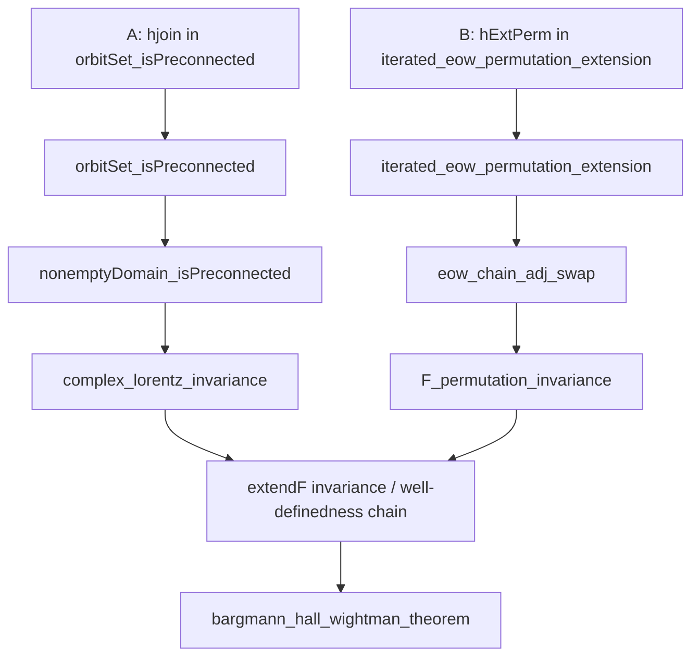

# BHW Connectedness Closure Strategy

Last updated: 2026-02-26

## Objective

Close all remaining `sorry` dependencies in `ComplexLieGroups/Connectedness.lean`
that block the constructive BHW theorem path (no axioms).

## Current Blockers (Exact)

1. `orbitSet_isPreconnected` at `Connectedness.lean:1844`
- Live hole A: `hjoin` at line `1890`
- Context: the unresolved branch is exactly `d ≥ 2`, `n > 0`.
- Existing resolved branches: `n = 0`, `d = 0`, `d = 1`.

2. `iterated_eow_permutation_extension` at `Connectedness.lean:4372`
- Live hole B: `hExtPerm` at line `4441`
- Context: nontrivial permutation branch (`σ ≠ 1`, `n ≥ 2`, `d ≠ 0`).

## Dependency Flow (BHW path)

## Execution Plan

1. Orbit-set lane (`A`)
- Keep all proof attempts in `test/` first.
- Target a no-axiom construction of
  `JoinedIn (orbitSet w) 1 Λ` for every `Λ ∈ orbitSet w` in the `d ≥ 2`, `n > 0` branch.
- Treat removed global geodesic endpoint lemma as invalid; do not reintroduce it unchanged.
- Port only compiled test proofs into working files.

2. Permutation-extension lane (`B`)
- Use `permInvariance_forwardTube_iff_extendF_overlap` as the reduction boundary.
- Close nontrivial `σ` branch by proving ET-overlap permutation invariance of `extendF`.
- Avoid circular use of `F_permutation_invariance` when constructing `hExtPerm`.

3. Integration checks
- `lake env lean OSReconstruction/ComplexLieGroups/Connectedness.lean`
- Re-run targeted downstream checks in `Wightman/Reconstruction/AnalyticContinuation` and `WickRotation/*`.

## Notes

- `D1OrbitSet.lean` is useful and already discharges the `d = 1` orbit branch.
- Remaining geometric work is strictly `d ≥ 2`, `n > 0` for the orbit-set blocker.
- As of this update, `Connectedness.lean` reports exactly two `sorry` warnings.
